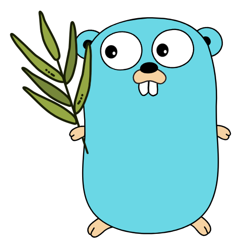

# tarragon

<p align="center">
    
</p>

<p align="center">
	Quick Terraform actions across multiple projects.
</p>
<p align="center">
	Written in Go.
</p>

## Why?

You have multiple [Terraform](https://www.terraform.io/) projects, but they're prototypes, quick tests, and don't warrant a dedicated deployment pipeline. So, you need to push them via the command line.

You want to quickly `validate/plan/apply` projects without constantly changing to different project directories.

You need to run `apply` on multiple projects at the same time because your latest code changes affect both services, and you don't want to forget to push one without the other.

Tarragon is a TUI application that lets you select multiple projects to perform simultaneous Terraform actions on.

## Where?

If you have [Go](https://go.dev/) installed, run:

```
go install github.com/sho-87/tarragon@latest
```

Otherwise, you can download the application for your operating system on the [Releases](https://github.com/sho-87/tarragon/releases) page.

## How?

Tarragon is designed to work with related projects, so assumes that your projects are nested somewhere inside a common parent directory. Example:

```
Services
|--- Project1
|--- Project2
|--- OtherService
     |--- Project3
```

First, make sure the Tarragon executable is available on your path, or otherwise callable from your command line.

Run `tarragon` in your command line, which will bring up the UI and find all nested projects from your current working directory.

You can also supply a different root directory using `tarragon --path "path/to/projects"`

### General Keybinds

(full list of keybinds can be found using `?`)

Run `validate/plan/apply` actions using `v`, `p`, and `a` on a highlighted project.

You can select multiple projects using `space` and run actions on them at the same time using the capitalized keybinds `V`, `P`, and `A`.

**Note**: `apply` will always run with the `--auto-approve` flag, so it's recommend to first run `plan` on the project and view the output (`tab`)
